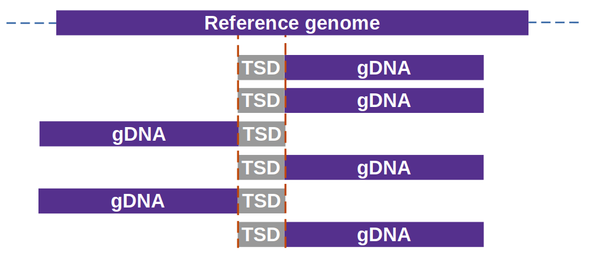
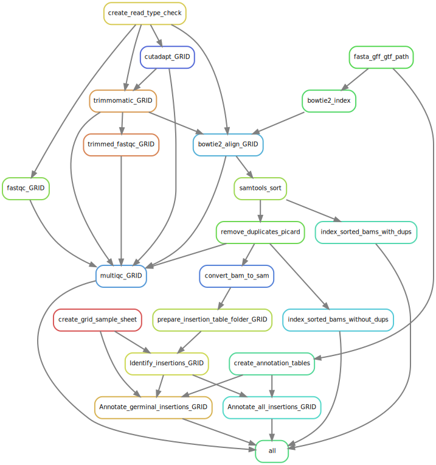

# MuWU - Mu-seq Workflow Utility  
[](https://snakemake.readthedocs.io) [](https://zenodo.org/badge/latestdoi/203787663)

## **02.11.2023: MuWU is is no longer maintained in this repository - all future development will happen in [https://github.com/groupschoof/MuWU](https://github.com/groupschoof/MuWU)**

<br>




- Automated workflow for the identification and annotation of transposable element insertion sites originally developed for the *[BonnMu](https://academic.oup.com/plphys/article/184/2/620/6117865)* resource and *Mutator* transposons in particular 
- MuWU is able to **detect any kind of TE insertion event** as long as: 
    - target site duplications (TSDs) are created by its integration 
    - the TSD length is known and   
    - the library is enriched for the areas of insertion/their immediate flanking sequences (e.g. Mutant-seq)

<br>  

**If you use MuWU in published research. Please cite the paper:**  
Stöcker, Tyll, et al. "MuWU: Mutant-seq library analysis and annotation." Bioinformatics (2021)  
- DOI: [https://doi.org/10.1093/bioinformatics/btab679](https://doi.org/10.1093/bioinformatics/btab679)  
- Link: [https://academic.oup.com/bioinformatics/advance-article/doi/10.1093/bioinformatics/btab679/6377773](https://academic.oup.com/bioinformatics/advance-article/doi/10.1093/bioinformatics/btab679/6377773)  

<br>  

**Novel features MuWU v1.5:**  
With the release of MuWU v1.5 it is now possible to perform an **additional downstream analysis** with which **sub-types/ specific elements** of the detected insertions/TEs can be determined.  
Basically, the user can supply a set of sequences which are specific to a specific subtype/element of the particular transposon in question.  
For this to work your input raw data reads have to contain this sequence - however the sequence can be cut/trimmed away during the MuWU run.  
In our (BonnMu) data we use a 12-fold degenerate TIR primer which is trimmed away before the alignment step.  
Based on the subtype/element sequence association all matching reads are sorted into files for the specific subtype/element.  
Once the insertions are identified we associate them via their corresponding reads with all respective subtypes/elements.  
Since in our work we face the additional difficulty that the TIR sequence of particular Mu element can very between the left and right end of the transposon, both a "\_L" (left side) as well as a "\_R" (right side) sequence can be supplied.  
If in your work this is not necessary or you only know one side, you can simply pass a pseudosequence for one of the pairs, so that the subtype/element is not counted double (example given in config.yaml).  
Several output tables are produced summarizing the information, as well as extension tables: normal MuWU output + the typing information.  
  
Insertions which can't be associated with a supplied type (no read matching) are addtionaly investigated.  
Their reads are extracted and - based on a user supplied motif - clustered and their redundancy removed.  
This allows for the **detection of putative novel types or elements** that either were not considered by the user or sequencing steps.  
For further details & options see the config.yaml.

<br>

# :control_knobs: Two modes - GRID and GENERIC:

**GRID**
- Requires as input DNA sequencing reads in grid design as outlined e.g. by [McCarty et al. 2013](https://journals.plos.org/plosone/article?id=10.1371/journal.pone.0077172); [Marcon et al. 2020](https://academic.oup.com/plphys/article/184/2/620/6117865) 
- Differentiates between heritable germinal insertions and somatic insertions and annotates both sets

**GENERIC**
- Does not require DNA sequencing reads of special experimental design
- Identifies & annotates all insertions of the particular TE


<br>  

# :gear: Options

All options of the workflow including which of the two methods to chose, input files and parameters (e.g. thread usage per step) can be set and changed in `config/config.yaml`.  
The most important parameters are briefly discussed in the following.  
Besides suitable handling of primers/adapters via trimming using cutadapt & trimmomatic the config.yaml allows to set:  
`overlap_size`, `overlap_support` and `extension` (all of of which accept an integer argument).

With `overlap_size` the user can change the length of the overlap region (start/end of reads) used inside identification algorithm.
This should be set equal to the length of TSD of the transposon being investigated (default is 9 = *Mutator* transposons).  

`overlap_support` controls the minimum amount of support needed to call an insertion (default is 2). With this default it would necessitate at least two reads that end & 2 reads which start with the overlap (TSD sequence at particular locus).

Using `extension`, upstream or downstream bases (equal to integer value) can be added to the gene models of the annotation to include UTRs, regulatory regions, promoter sequences etc.. This is helpful since insertions outside of gene models can otherwise not be annotated and thus allows for easier association of these regions with the gene at the particular locus.

<br>  

# :arrow_double_down: Download & Setup

There are 2 ways of using MuWU:  
* via cloning this repo and then using conda/mamba installation of necessary software at runtime
* a singularity container, which requires no further downloads except for the container itself  


## Option 1. Cloning of this repo and download/installation of software at runtime
### Step 1 - Set up conda and snakemake: 
Install the Python 3 version of Miniconda.
you can get it here: https://docs.conda.io/en/latest/miniconda.html

Answer yes to the question whether conda shall be put into your PATH environment variable.

Then, you can install mamba and Snakemake with

`conda install -c conda-forge -c bioconda mamba "snakemake>=7.0.0"`  

### Step 2 - Preparing the working directory:

Clone the current release of the MuWU pipeline.

`git clone https://github.com/tgstoecker/MuWU.git`

With conda and the included YAML files all required software and dependencies are downloaded and prepared into conda environment during runtime of the workflow.


## Option 2. Singularity container (does currently not incl. optional TE typing)
### Step 1 - Set up Singularity on your system: 
Install the Python 3 version of Miniconda.
you can get it here: https://docs.conda.io/en/latest/miniconda.html

Answer yes to the question whether conda shall be put into your PATH environment variable.

Install mamba:
`conda install -c conda-forge mamba`

Then, you can install Singularity (3.6.1) with
`mamba install -c conda-forge singularity=3.6.1`  
  
Alternatively install Singularity based on these instructions: https://singularity.lbl.gov/install-linux  
  
### Step 2 - set up the container to run the workflow  ####

**Download the MuWUv1.1.1.sif file, hosted here:**  [https://uni-bonn.sciebo.de/s/gu0b5rMHJcDgRqH](https://uni-bonn.sciebo.de/s/gu0b5rMHJcDgRqH)  
  
Create a sandbox from the .sif file:  
It is might be necessary to set SINGULARITY_TMPDIR to a particular (or newly created) tmp directroy as singularity on some systems uses `/tmp` directory as standard while building. This can lead to storage errors if the space is limited by your sysadmin.  
Easy workaround - set SINGULARITY_TMPDIR to a directory where space is plenty:  
`export SINGULARITY_TMPDIR=/path/to/where/tmp/should/be`  
  
`singularity build --sandbox MuWU-sandbox MuWUv1.1.sif`  
  
Access the sandbox:  
`singularity shell --home $PWD MuWU-sandbox`
  
Move "inside" and navigate to the MuWU directory (& inside one of test directories)
`cd MuWU-sandox/MuWU/`  
  
Activate conda environment (snakemake and all MuWU dependencies are already installed):  
`source activate snakemake`  

<br>  

# :beginner: Usage & Outputs

## Required input files

As described under options, control of parameters and inputs is inside `config/config.yaml` - for more details for all options please see that file.

Both the GRID & GENERIC methods require:
1. Reference sequence & annotation for the species in question 
   - MuWU can handle both file paths as well URL links (will download files in the later case automatically)
   - Files can be either unpacked or gzipped
   - We currently support gff3, gtf and genbank (.gbff & .dat) as annotation formats
     - In case of a GenBank annotation we also demand the corresponding "assembly_report.txt" to be supplied (or an URL to be given) in order to correctly rename the chromosomes/scaffolds
2. SE or PE sequencing reads (unpacked or gzipped) (best: enriched for insertions and with a primer/adapter PCR approach yielding starts/ends with TSD sequence after trimming)
3. File describing samples (**this differs between the methods!**)
   - GRID: an excel table needs to be supplied under `config/stock_matrix/` (example provided)
   - GENERIC: appropiately modified `config/samples.tsv` file
   - -> In both cases the file is used to infer the complete structure of the workflow and SE/PE type of the reads
   - -> In the GRID method it is important that the base name of the fastq file/s match its corresponding entry in the the stock matrix table


## Once everything is set up - run the workflow:  
Change thread options for individual rules in the config.yaml file.  
Check the workflow (dryrun; testbuild of DAG):  
`snakemake --use-conda --cores xx --default-resources 'tmpdir="./tmp/"' -np`
  
Run the workflow - 3 options:  
- `snakemake --use-conda --cores xx --default-resources 'tmpdir="./tmp/"'` or  

- `snakemake --use-singularity --use-conda --cores xx` or 

- `snakemake --cores xx`  (when using the interactive singularity container)
  
Using the second option (incl. `--use-singularity`) is a cool option combining Conda package management with containers. Snakemake will first pull the defined container image (docker://tgstoecker/muwu_v1.5), and then create the requested conda environment from within the container. Please note however, that the user has to make sure that singularity needs to be set up correctly and have all required permissions which - depending on the specific circumstances - can be tricky (especially if you don't have sudo rights).  
  
Using the third option (without `--use-conda`) will expect all software to be readily available and in your $PATH.  
This is the intended command if you use the singuarity container - here the main software and test folder all have their respective environments **already installed**.  
If you omit this parameter snakemake/conda will try to download & install all required software which the container was specifically build for to already to contain.  
Of course this is exactly the behaviour you want if you cloned MuWU here from github and want all the dependencies to be installed at runtime.  


## Outputs  
The main output files are:  

1. MultiQC HTML output (open in browser):  
```
/MuWU/multiqc/multiqc.html
```  
  
2. (Annotated) Insertion tables under `MuWU/results/insertions_table_final/`  
```
all_identified_insertions.csv
germinal_identified_insertions.csv

#! only in GRID method
all_identified_insertions_annotated.csv
germinal_identified_insertions_annotated.csv
```

<br>  

# :heavy_check_mark: Tests
We have included easily executable tests to demonstrate MuWU's functionality and easy adaptability to a broad range of TE insertion types (under `tests/`).  
Navigating to one of these directories and running either:  
`snakemake --use-conda --cores xx`  
`snakemake --cores xx` (when using the singularity container)  
will run the respective test run of the workflow.  
In case of the latter one in which a comparison to a test data set and results [ITIS](https://github.com/Chuan-Jiang/ITIS) is being made, the final step of the workflow will print results to the console.  
These results are also displayed in the respective README.md of the test directory.  

- [GRID method test with *Mutator* TE (TSD = 9bp) - *Zea mays*](https://github.com/tgstoecker/MuWU/tree/master/tests/MuWU_test_germinal_Mutator)
- [GENERIC method test with *mping* TE (TSD = 3bp) - *Oryza sativa*](https://github.com/tgstoecker/MuWU/tree/master/tests/MuWU_ITIS_test_with_mping_TE) based on [ITIS](https://github.com/Chuan-Jiang/ITIS) test data


<br>  

# :framed_picture: Visualized
### GRID workflow (as snakemake rulegraph):
`snakemake --rulegraph | dot -Tsvg > rulegraph.svg`

<br>  

  
  
### GRID workflow + TE/element typing (as snakemake rulegraph):
`snakemake --rulegraph | dot -Tsvg > rulegraph.svg`

<br>  

  
  
  
# :scroll: Complete list of software
- bioconductor-iranges ==2.26.0
- biopython =1.78
- bowtie2 ==2.4.1
- cd-hit ==4.8.1
- coreutils =8.31
- cutadapt ==2.10
- fastqc ==0.11.9
- findutils ==4.6
- gffread =0.12.1
- grep =3.4
- mamba ==0.14.1
- multiqc ==1.10.1
- numpy =1.16.4
- pandas =0.25.0
- picard ==2.22.1
- pigz ==2.3.4
- python >=3.6
- r-base ==4.1.0
- r-data-table ==1.14.2
- r-doparallel ==1.0.17
- r-dplyr ==1.0.6
- r-foreach ==1.5.2
- r-fuzzyjoin ==0.1.6
- r-readxl ==1.3.1
- r-stringr ==1.4.0
- r-tibble ==3.1.6
- samtools ==1.10
- seqkit ==2.2.0
- snakemake >=7.0.0
- snakemake-wrapper-utils >=0.2.0
- tbb ==2020.2
- trimmomatic ==0.36
