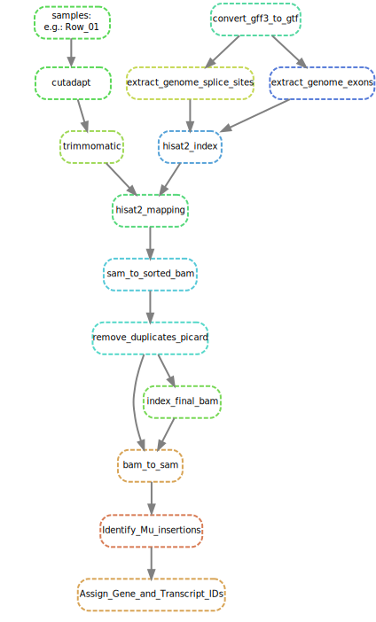

# MuWU
## Mu-Seq Workflow Utility 

- reference to publication and background information 
- special focus on python script

### Setting up the conda environment: 
Install the Python 3 version of Miniconda.
Answer yes to the question whether conda shall be put into your PATH.
For detailed options concerning conda/bioconda see:

Then, you can install Snakemake with

`conda install -c bioconda -c conda-forge snakemake`

Preparing a working directory
First, create a new directory and change into that directory in your terminal.

Download/Clone the current release of the MuWU pipeline into the directory.

The included environment.yaml file can be used to install all required software into an isolated Conda environment with a name of your choice - in the following we will call it "snakemake-MuWU":

`conda env create --name snakemake-MuWU --file environment.yaml`

Activating the environment
To activate the snakemake-tutorial environment, execute

`conda activate snakemake-MuWU`

Now you can use the installed tools and our workflow without any software dependency issues.
For detailed options of snakemake see: 

Please note that at the moment the workflow still requires to adhere to the directory structure explained in the following.
During the workflow new directories will be created however for easy usage please copy or move your sequencing data to the RawReads directory and assembly (.fa) and annotion (.gff3) to the FGS directory.
E.g. currently used (23.08.19) latest maize reference assembly and annotation:

  `wget ftp://ftp.ensemblgenomes.org/pub/plants/release-44/fasta/zea_mays/dna/Zea_mays.B73_RefGen_v4.dna.toplevel.fa.gz`
  
  `wget ftp://ftp.ensemblgenomes.org/pub/plants/release-44/gff3/zea_mays/Zea_mays.B73_RefGen_v4.44.gff3.gz`

It is also necessary to stick to the following naming scheme of the samples:
column/row; sample number; left/right
e.g.:
Col_01_1.fq; 
Col_01_1.fq; 
Row_01_1.fq; 
etc. 

### The workflow in the current release:

#### Future updates will increase the ease of use even more:
- report generation (.html) and tar archive for ultimate everlasting reproducability
- make the Snakefile more robust expand over all samfiles and feed this to script OR use params to - ALSO Johannes told me using my shell solution is not optimal but I should rather stick to python here
- switch between HISAT2 and Bowtie2 for either spliced/non-spliced alignments
- JSON of YAML file in which all options of all steps can be modified to the specific use case and computional resources available
- piping directly into .bam files and using these for the Mu insertion characterization
- additional final output files annotated with only geneID, for those uninterested in the corresponding transcripts
