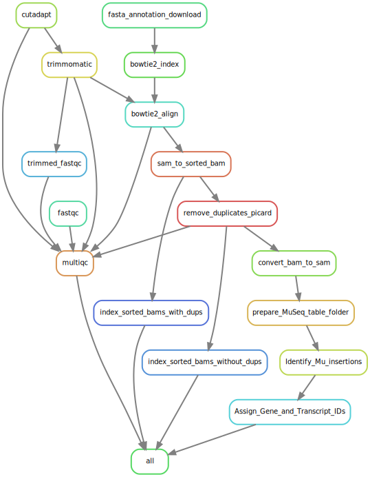

# MuWU
## Mu-Seq Workflow Utility 
[](https://snakemake.readthedocs.io)

- Automated workflow for the identification and annotation of *Mutator* insertion sites used in the creation of the BonnMu resource
- Requires as input Mu-seq reads in grid design as outlined by McCarty et al. 2013 and Liu et al. 2016 
<br>  

There are 2 ways of using MuWU:  
* a singularity container, which includes a **working example with exemplary data** and requires no further downloads except for the container itself  
* via cloning this repo and then using conda installation of necessary software at runtime  
  
The main output files are:  

1. MultiQC HTML output (open in browser):  
```
/MuWU/multiqc/multiqc.html
```  
  
2. Gene & Transcript level final output tables:  
```
/MuWU/MuSeq_table_final/Mu_single_GeneIds_gene_lengths_and_stock.csv
/MuWU/MuSeq_table_final/Mu_single_TranscriptIds_transcript_lengths_and_stock.csv
```
<br>  

## Option 1. Singularity container (incl. working example)
### Step 1 - Set up Singularity on your system: 
Install the Python 3 version of Miniconda.
you can get it here: https://docs.conda.io/en/latest/miniconda.html

Answer yes to the question whether conda shall be put into your PATH environment variable.

Then, you can install Singularity with
`conda install -c conda-forge singularity=3.6.1`  
  
Alternatively install Singularity based on these instructions: https://singularity.lbl.gov/install-linux  
  
### Step 2 - set up the container to run the workflow  ####

**Download the MuWU-example.sif file, hosted here:**  https://uni-bonn.sciebo.de/s/LsmuNDuEeA0sUer  
  
Create a sandbox from the .sif file:  
This can take a while (on Intel(R) Xeon(R) CPU E5-2690 v4@ 2.60GHz roughly 30 min!), since the sandbox will be over 20Gb in size.  
It is might be necessary to set SINGULARITY_TMPDIR to a particular (or newly created) tmp directroy as singularity on some systems uses `/tmp` directory as standard while building. This can lead to storage errors if the space is limited by your sysadmin.  
Easy workaround - set SINGULARITY_TMPDIR to a directory where space is plenty:  
`export SINGULARITY_TMPDIR=/path/to/where/tmp/should/be`  
  
`singularity build --sandbox MuWU-example MuWU-example.sif`  
  
Access the sandbox:  
`singularity shell --writable --no-home MuWU-example`
  
Once "inside", navigate to the MuWU directory  
`cd /MuWU/`  
  
Activate conda environment (snakemake is already installed):  
`source activate snakemake`  

### Step 3 - run the workflow:  

Check the workflow (dryrun; testbuild of DAG):  
`snakemake --use-conda --cores 24 --conda-prefix conda_envs -np`
  
Run the workflow:  
(on Intel(R) Xeon(R) CPU E5-2690 v4@ 2.60GHz with 24 cores it takes ~ 10min)  
`snakemake --use-conda --cores 24 --conda-prefix conda_envs`  
<br>  


## Option 2. Cloning of this repo and download/installation of software at runtime
### Set up conda and snakemake: 
Install the Python 3 version of Miniconda.
you can get it here: https://docs.conda.io/en/latest/miniconda.html

Answer yes to the question whether conda shall be put into your PATH environment variable.

Then, you can install Snakemake with

`conda install -c bioconda -c conda-forge snakemake=5.7.0`  
<br>  

### Preparing the working directory:

Download/Clone the current release of the MuWU pipeline.

With conda and the included YAML files all required software and dependencies are downloaded and prepared into conda environment during runtime of the workflow.

MuWU requires to adhere to the directory structure explained in the following.
During the workflow new directories will be created, however for easy usage please copy or move your sequencing data to the RawReads directory. 
Fasta and annotation files are downloaded automatically from ensembl; e.g. currently used: v4 maize reference assembly and annotations:

- Zea_mays.B73_RefGen_v4.dna.toplevel.fa

- Zea_mays.B73_RefGen_v4.46.gtf

- Zea_mays.B73_RefGen_v4.46.gff3


It is also necessary to stick to the following naming scheme of the samples:
column/row; sample number; left/right
e.g.:
Col_01.1.fq; 
Col_01.2.fq; 
Row_01.1.fq; 
etc. 

Lastly, copy/link a stock matrix .xlsx table (example file given) into the stock_matrix directory.

This will assign the mutation to the corresponding stock automatically at the end of the workflow.  
<br>  

### Starting MuWU:
Change thread options for individual rules in the config.yaml file.  
Then specifiy overall threads and start MuWU via:  
`snakemake --cores xx --use-conda`  
<br>  

### The workflow in the current release:
`snakemake --rulegraph | dot -Tsvg > rulegraph.svg`

